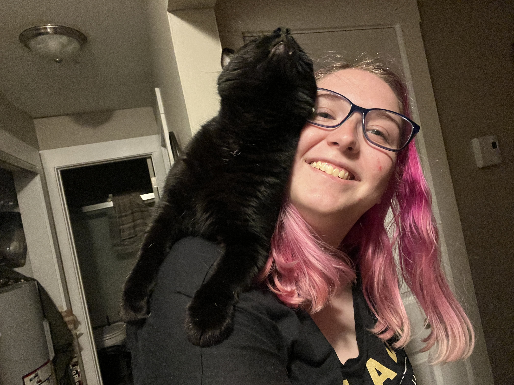

Sarah Popp (they/them) is a third-year astronomy Ph.D. student at Indiana University in Bloomington, and the department Outreach Coordinator. 
They are passionate about outreach, education, and science communication.
Outside of astronomy, Sarah plays violin, has too many craft projects in progress, and hangs out with their cat Moon.

***

[Home](./) • [Research](research.md) • CV • Contact • Cat Pictures
